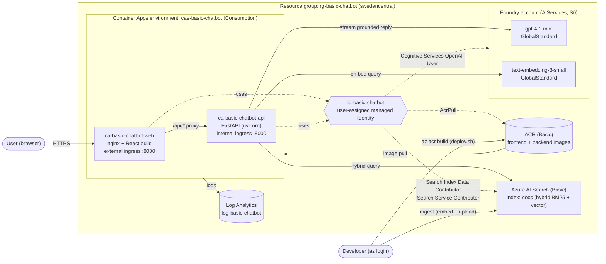

# basic-chatbot

Basic RAG chatbot on Azure: a React UI talks to a FastAPI backend, which grounds answers in documents retrieved from **Azure AI Search**.

## Tech stack
| Layer    | Tech                          |
| -------- | ----------------------------- |
| Frontend | React + TypeScript, Vite, pnpm |
| Backend  | Python, FastAPI, uv           |
| RAG      | Azure AI Search (retrieval)   |
| LLM      | Foundry: gpt-4.1-mini, text-embedding-3-small |
| Auth     | Keyless (Entra ID, `DefaultAzureCredential`) |
| Infra    | Terraform (`infra/`)          |

See [`docs/rag.md`](docs/rag.md) for the RAG design (ingestion and retrieval).

## Structure
```
frontend/   React + TS chat UI (Vite); Dockerfile = nginx serving the build, proxying /api/* to the backend
backend/    FastAPI app; Dockerfile = uvicorn on :8000
  app/main.py           FastAPI app: /health, POST /chat (retrieves, then streams a grounded reply as text/plain)
  app/chat.py           Chat request models + streaming from gpt-4.1-mini
  app/config.py         Settings from env / .env
  app/azure_clients.py  Keyless Search + OpenAI clients
  app/rag/              Azure AI Search RAG
    index.py            `docs` index schema (hybrid: BM25 + HNSW vectors)
    chunking.py         Markdown chunking (~500 tokens, 75 overlap)
    ingest.py           CLI: chunk, embed, upload documents
    retrieve.py         Hybrid query (keywords + embedded query vector), top RAG_TOP_K chunks
    prompt.py           Grounded system prompt, numbered sources, "Sources:" footer
data/       Sample documents to ingest (a fictional handbook)
infra/      Terraform (see infra/README.md)
docs/       Design notes
```

## Run
Provision Azure first (see [`infra/README.md`](infra/README.md)). `infra/write-env.sh` writes `backend/.env`. Auth uses your `az login`.
```bash
# backend
cd backend && uv sync
uv run uvicorn app.main:app --reload   # http://localhost:8000

# frontend (Node 24 LTS, pnpm via `corepack enable`)
cd frontend && pnpm install && pnpm dev   # http://localhost:5173
```

## Run in containers (local)
Runs the same images that ship to Azure, with the same topology: the frontend's nginx serves the UI and proxies `/api/*` to the backend, which publishes no host port.

Prerequisites:
- [OrbStack](https://orbstack.dev/) (`brew install --cask orbstack`, then open it once), which provides `docker` and `docker compose`.
- `az login` on the host. Compose mounts `~/.azure` read-only into the backend. The local-only image target adds the Azure CLI so that `DefaultAzureCredential` can use your session. No keys are involved.
- `backend/.env`, written by `infra/write-env.sh`.

```bash
docker compose up --build        # http://localhost:8080 (add -d to run in the background)
docker compose down
```
The backend builds with `target: local`. The default Dockerfile target, which `infra/deploy.sh` builds, is the lean image without the Azure CLI.

## Deploy to Azure Container Apps
Both apps run in one Container Apps environment. The frontend has external ingress, and its nginx proxies `/api/*` to the backend. The backend has internal ingress only and calls AI Search and Foundry through a user-assigned managed identity, so no keys are involved. In local dev, Vite proxies `/api/*` to `localhost:8000` the same way.
```bash
cd infra
terraform apply tfplan   # after reviewing the plan
./deploy.sh              # az acr build both images, roll them out, print the URL
```


## Architecture
Everything lives in one resource group, `rg-basic-chatbot` (`swedencentral`), tagged `poc`, `owner`, `created`. No resource accepts API keys: the apps authenticate with a user-assigned managed identity, and the developer uses `az login`.


